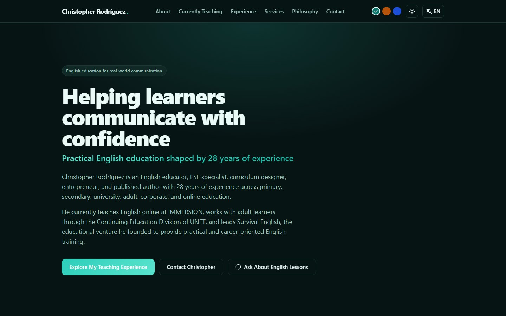
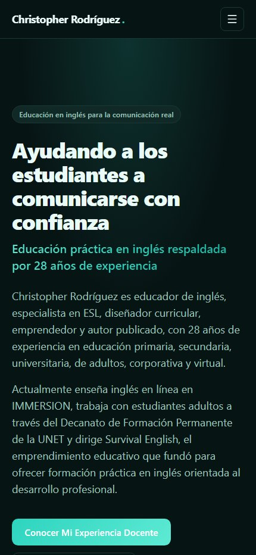

# Christopher Rodríguez — Portfolio & Online CV

Bilingual (English/Spanish) professional portfolio for **Christopher Rodríguez** (Jack Christopher Rodríguez Belandria), an English educator, ESL specialist, curriculum designer and published author. Built as a fully static single-page application with React, TypeScript and Vite.

**Live portfolio:** [liriothteltanion.github.io/ChristopherRodriguezCVOnline](https://liriothteltanion.github.io/ChristopherRodriguezCVOnline/) · **Current version:** `1.1.0` · [Changelog](CHANGELOG.md)

## Current professional status

Christopher holds three simultaneous, active roles, each modeled explicitly in the data layer:

1. **Online English Teacher at IMMERSION** — remote, since March 2026.
2. **English Teacher, Continuing Education Division at UNET** — San Cristóbal, Venezuela, ongoing.
3. **Founder & English Instructor at Survival English** — his independent venture, since 2017.

All three are marked `current: true` with a manually controlled `displayOrder` (see [`src/data/currentRoles.ts`](src/data/currentRoles.ts)) so Survival English's earlier start date (2017) never causes it to sort above IMMERSION's — order is deliberate, not date-derived.

## Real product tour

The visuals below are generated from the real application with public portfolio content. The animated tour cycles through the English desktop hero, current teaching roles and Spanish mobile experience; readers who prefer reduced motion receive the static desktop capture.

<picture>
  <source media="(prefers-reduced-motion: reduce)" srcset="./public/images/portfolio-desktop.jpg" />
  
</picture>

| Desktop interface                                                                                                                     | Spanish mobile interface                                                                                                              |
| ------------------------------------------------------------------------------------------------------------------------------------- | ------------------------------------------------------------------------------------------------------------------------------------- |
|  |  |

[Open the current-teaching capture](./public/images/portfolio-current-teaching.jpg) · [Open the 1280 × 640 social card](./public/images/christopher-portfolio-social-preview.png)

## Features

- **Portfolio in one page**: hero, about, currently-teaching (3 active roles), professional ecosystem diagram, experience timeline (current vs. previous), international experience, Survival English deep-dive, services, teaching philosophy, stats, contact.
- **Bilingual (EN/ES)**: every user-facing string has an English and Spanish version. Language is auto-detected from the browser on first visit, persisted in `localStorage`, and switches instantly with no page reload. Screen readers are notified of language changes via an `aria-live` region.
- **Light/dark theme + accent color picker**: light/dark respects `prefers-color-scheme` on first visit. Independently, an accent color picker (teal default / golden / blue) in the header lets visitors swap the whole site's accent palette; both preferences persist in `localStorage`. See `src/hooks/useTheme.ts` and `src/hooks/useColorTheme.ts`.
- **Country flags**: small inline SVG flags (`src/components/icons/FlagIcons.tsx`) mark each role/timeline entry's country and the International Experience cards. Rendered as SVG rather than Unicode flag emoji because Windows (Segoe UI Emoji) shows flag emoji as plain two-letter codes instead of flags.
- **Content integrity system**: every claim carries a `verification` / `sourceStatus` tag (`userConfirmed`, `cvReported`, `institutionWebsite`, `verificationRecommended`). The `SHOW_UNVERIFIED_METRICS` flag in [`src/data/metrics.ts`](src/data/metrics.ts) keeps any future unverified statistic out of the headline stat counters without deleting the underlying data.
- **IMMERSION safety guardrails**: the school's public institutional description is rendered in a clearly labeled, collapsible "About IMMERSION" block with a mandatory attribution note directly beneath it (not hidden in a tooltip), making clear it describes the school's general offering, not Christopher's personal duties.
- **Accessible by default**: skip link, semantic landmarks, keyboard-operable expand/collapse (`aria-expanded`/`aria-controls`), visible focus rings, `aria-current` on nav, decorative icons marked `aria-hidden`, external links use `target="_blank" rel="noopener noreferrer"` with accessible labels, and full `prefers-reduced-motion` support (the active-status pulse animation and all Framer Motion entrance animations are disabled).
- **No backend, no database, no router**: fully static; navigation is anchor-based with `IntersectionObserver` highlighting the active section.

## Tech stack

- [React 19](https://react.dev/) + [TypeScript](https://www.typescriptlang.org/)
- [Vite](https://vite.dev/) (build tool and dev server)
- [Tailwind CSS 4](https://tailwindcss.com/) + a small custom design-system layer in [`src/styles/globals.css`](src/styles/globals.css) (CSS variables for theming)
- [Framer Motion](https://motion.dev/) for entrance animations (disabled automatically under reduced motion via `MotionConfig reducedMotion="user"`)
- [Lucide React](https://lucide.dev/) for icons
- [ESLint](https://eslint.org/) + [Prettier](https://prettier.io/) for linting/formatting

## Getting started

```bash
npm install
npm run dev
```

The dev server runs at `http://localhost:5173`.

## Available scripts

| Command                   | Description                                                      |
| ------------------------- | ---------------------------------------------------------------- |
| `npm run dev`             | Start the Vite dev server                                        |
| `npm run build`           | Type-check (`tsc -b`) and build the production bundle to `dist/` |
| `npm run preview`         | Preview the production build locally                             |
| `npm run lint`            | Run ESLint over the whole project                                |
| `npm run typecheck`       | Run the TypeScript project build without emitting app assets     |
| `npm test`                | Verify public URLs, JSON-LD, manifest and visual asset contracts |
| `npm run capture:visuals` | Rebuild real desktop/mobile captures and social visuals          |
| `npm run format`          | Format the codebase with Prettier                                |

## Project structure

```
src/
  components/     UI components (Hero, AboutSection, CurrentTeachingSection,
                  CurrentRoleCard, ProfessionalEcosystem, ExperienceTimeline,
                  ExperienceDetails, InternationalExperience,
                  SurvivalEnglishSection, ServicesSection, TeachingPhilosophy,
                  StatsSection, ContactSection, Header, Footer, ...)
  context/        AppContext (language + theme, shared via React context)
  data/           Content & types: profile, currentRoles, experience,
                  services, institutions, metrics, publications, seo,
                  translations, types
  hooks/          useLanguage, useTheme, useReducedMotion
  styles/         globals.css (design tokens, pulse animation, print styles)
public/
  icons/          Favicon
  images/         Real product captures, accessible tour and social preview
  site.webmanifest, robots.txt, sitemap.xml
scripts/
  verify-public-metadata.mjs
tools/visuals/
  capture-portfolio.mjs
```

## How to update the content

All editable content lives under `src/data/`, with **no JSX changes required** for text edits:

- **Identity / contact**: [`src/data/profile.ts`](src/data/profile.ts) — display name, full name, titles, keywords, WhatsApp/email links, social links (YouTube).
- **Current roles** (IMMERSION, UNET, Survival English): [`src/data/currentRoles.ts`](src/data/currentRoles.ts).
- **Previous experience**: [`src/data/experience.ts`](src/data/experience.ts).
- **IMMERSION institutional context & attribution note, external links (IMMERSION website, Survival English YouTube channel)**: [`src/data/institutions.ts`](src/data/institutions.ts).
- **Services**: [`src/data/services.ts`](src/data/services.ts).
- **Stats / metrics**: [`src/data/metrics.ts`](src/data/metrics.ts) — toggle `SHOW_UNVERIFIED_METRICS` once a `verificationRecommended` figure is confirmed.
- **Publications**: [`src/data/publications.ts`](src/data/publications.ts).
- **SEO / meta**: [`src/data/seo.ts`](src/data/seo.ts).
- **All other UI chrome copy** (nav, buttons, section titles/subtitles, footer): [`src/data/translations.ts`](src/data/translations.ts).

## Public metadata and visual assets

- The canonical production URL is `https://liriothteltanion.github.io/ChristopherRodriguezCVOnline/` across HTML metadata, JSON-LD, the manifest, robots and sitemap.
- `public/images/christopher-portfolio-social-preview.png` is the 1280 × 640 Open Graph/Twitter image. It is generated from the real interface and kept below 1 MB.
- `public/images/portfolio-desktop.jpg`, `portfolio-mobile.jpg` and `portfolio-current-teaching.jpg` are public-content captures. They contain no accounts, private browser state or unpublished client information.
- `public/images/portfolio-tour.svg` embeds the reviewed captures and stops cycling under `prefers-reduced-motion`.
- Run `npm run capture:visuals` after a material visual release, inspect every output and then run `npm test`. The capture workflow is documented in [`tools/visuals/README.md`](tools/visuals/README.md).
- Survival English's official social profiles — [YouTube](https://www.youtube.com/@Inglesdesupervivencia/featured), [TikTok](https://www.tiktok.com/@inglesdesupervivencia), [Instagram](https://www.instagram.com/inglesdesupervivencia/) — are set as an array in `institutionLinks["survival-english"]` in `src/data/institutions.ts`. That single array feeds the Survival English card's expanded view, the dedicated Survival English section (primary CTA + "Follow" icon row), the footer icons, and the Person JSON-LD `sameAs`. Add further real profiles the same way once provided; each entry needs a matching icon in `src/components/icons/BrandIcons.tsx` if lucide-react doesn't already export one (it dropped most brand/logo glyphs, so YouTube, TikTok and Instagram are hand-inlined there).

## Facts still requiring confirmation

These are flagged with `verificationRecommended` in the data and are displayed with cautious wording rather than as confirmed fact:

- **UNET — "~20% growth in student participation"**: shown only inside the role's detailed description, not as a homepage stat.
- **Survival English — "500+ professionals trained"**: shown as a headline stat (it is CV-reported) with a visible verification note; update the value directly in `src/data/metrics.ts` once records are confirmed.

## Accessibility

- Skip-to-content link, visible on keyboard focus.
- Semantic landmarks (`header`, `main`, `nav`, `section`, `footer`) and a logical heading hierarchy (single `h1` in the hero, `h2` per section).
- All interactive controls are real `<button>`/`<a>` elements, fully keyboard-operable, with visible focus rings.
- `aria-current`, `aria-expanded`, `aria-controls` used where state needs to be conveyed to assistive tech.
- The active-status indicator pairs a pulsing dot with visible text (`Currently Active` / `Actualmente Activo`) — color and animation are never the only signal.
- Respects `prefers-reduced-motion` (Framer Motion via `MotionConfig reducedMotion="user"`, plus a CSS-level fallback for the status pulse).

## Deployment (GitHub Pages)

The production site is deployed at:

```text
https://liriothteltanion.github.io/ChristopherRodriguezCVOnline/
```

[`.github/workflows/deploy.yml`](.github/workflows/deploy.yml) builds and deploys automatically on every push to `main` (installs with `npm ci`, runs lint, type-check, metadata/asset tests and the production build, then uploads `dist/` as a Pages artifact and deploys it), using the official `actions/configure-pages`, `actions/upload-pages-artifact` and `actions/deploy-pages` actions with minimal permissions.

### GitHub Pages base path

`vite.config.ts` deliberately uses `base: "/ChristopherRodriguezCVOnline/"`. Public HTML asset links use Vite's `%BASE_URL%` token, while canonical and social metadata use the complete production URL. Keep all three values synchronized if the repository or host ever changes.

### One-time setup

```bash
# 1. Create the repository on GitHub first (web UI, or `gh repo create` if you have the CLI).

# 2. From this project folder:
git init
git add .
git commit -m "Initial commit: Christopher Rodríguez portfolio"
git branch -M main
git remote add origin https://github.com/<your-username>/<your-repo>.git
git push -u origin main
```

Then on GitHub: **Settings → Pages → Build and deployment → Source → GitHub Actions**. The workflow runs automatically on the push (or re-run it manually from the **Actions** tab) and the site goes live at the URL shown there.

You can also do steps 2 onward from **GitHub Desktop**: "Add local repository" → point it at this folder → "Publish repository".

### Other static hosts

This release is configured specifically for the GitHub Pages project path `base: "/ChristopherRodriguezCVOnline/"`. Do not upload its existing `dist/` unchanged to the root of a Netlify, Vercel or other custom-domain deployment: first change `vite.config.ts` to `base: "/"`, rebuild with `npm run build`, and verify the generated asset URLs. Keep the current project-path base when the alternative host serves the site from `/ChristopherRodriguezCVOnline/` instead of the domain root.

If another host becomes canonical, update the production URL contract in `index.html`, the manifest, robots, sitemap, README and `scripts/verify-public-metadata.mjs` together.

## License

This repository contains Christopher Rodríguez's personal portfolio content and is not licensed for reuse of its personal/professional content (name, CV, biography, photos). The code structure itself may be used as a learning reference.
